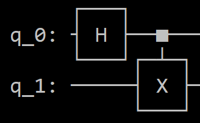

# DD2391 Security Project - Quantum Key Distribution
The purpose of this project is to implement quantum key distribution (QKD) protocols to securely exchange cryptographic keys. Specifically, the BB84 and E91 protocols were implemented using the Qiskit Python library and quantum simulators to showcase how quantum communication can detect eavesdropping. We simulated noise, eavesdropping and applied methods such as key reconiliation and privacy amplification to enhance security. 

## Group 8
Members:
- Alex Shariat Zadeh
- Anton Brömster
- Jonatan Tuvstedt
- Trang Nguyen

## Table of Contents
1. [Installation](#introduction)
2. [Usage](#usage)
    1. [BB84](#bb84)
    2. [E91](#e91)
3. [Problem Description](#problem-description)
    1. [Protocols](#protocols)
    2. [Interference Tests](#interference-tests)
    3. [Eavesdropping](#eavesdropping)
    4. [Key Reconciliation and Privacy Amplification](#key-reconciliation-and-privacy-amplification)
4. [Background](#background)
    1. [Crash Course in Quantum Computing](#crash-course-in-quantum-computing)
    2. [Bell Circuit](#bell-circuit)
    3. [The Assumptions of the Project](#the-assumptions-of-the-project)
    4. [BB84 Protocol](#bb84-protocol)
    5. [E91 Protocol](#e91-protocol)
5. [Deliverables](#deliverables)
6. [Documentation of the Project](#documentation-of-the-project)
    1. [BB84](#bb84-3)
        1. [Components](#components)
        2. [BB84 Protocol](#bb84_protocol)
        3. [Noise Model](#noise-model)
        4. [Spot Checking](#spot-checking)
        5. [Features](#features)
    2. [E91](#e91-3)
        1. [Components](#components-1)
        2. [E91 Protocol](#e91_protocol)
        3. [Key Reconciliation and Privacy Amplification](#key-reconciliation-and-privacy-amplification-3)
7. [Documentation of testing the project](#documentation-of-testing-the-project)
    1. [BB84](#bb84-4)
    2. [E91](#e91-4)
9. [Contribution](#contribution)
10. [References](#references)

## Installation
1. Clone the repository:<br/>
` git clone https://github.com/Glassar/dd2394-Security-Project.git`

2. Make sure to have python3 and pip installed

3. Install dependencies: <br/>
`pip install qiskit`<br/>
`pip install qiskit_aer`

## Usage
### BB84
Run the test file `bb84_test.py` with `python3 bb84_test.py`

### E91
Run the test file `e91_test.py` with `python3 e91_test.py`

## Problem description
Quantum mechanics and quantum computing offers a new way of cryptographic key distribution that is fundamentally secure against undetected eavesdropping. This security stems from a fundamental principle of quantum mechanics: any measurement of a quantum state changes the state itself. In other words, if an eavesdropper intercepts and measures the quantum state before it reaches the intended recipient, the state will be altered, allowing both parties to detect the intrusion. 

Using this quality, several QKD protocols have been developed to securely transmit cryptographic keys over open and insecure channels, with the assertion that any unauthorized access to the key will be revealed. 

### Protocols
For this project, we have chosen to implement two QKD protocols, specifically the BB84 and E91 protocols. These implementations will be carried out using the Qiskit Python quantum programming library, with the quantum circuits executed on the Qiskit Aer simulator.

### Interference Tests
In addition to implementing the basic key distribution protocols, we also implemented eavesdropping detection mechanisms for both protocols. These mechanisms use statistical methods to identify deviations in the results between the two parties, indicating the presence of interference that would not occur under normal conditions. 

Such interference arises either from noise, given that quantum computers are not foolproof and gate operations or measurements can produce incorrect values, or from eavesdropper intercepting the key distribution and altering the transmitted quantum states. Therefore, if the detection protocol return an interference level greater than our safety threshold, then we conclude that eavesdropping has occured and subsequently discard the results.

### Eavesdropping
Eavesdropping was integrated into both protocols, with an eavesdropper, referred to as Eve, intercepting and measuring a few of the transmissions while ensuring that some information is forwarded to Bob for measurement. However, due to the randomness in how the information is transmitted, which is undetectable, Eve cannot carry out this process perfectly, meaning that there will be interference which we can detect. 

### Key Reconciliation and Privacy Amplification
Key reconciliation and privacy amplification are crucial steps in QKD protocols as they help ensure that two parties can established a secret key over a insecure channel. Due to the inherent noise in quantum processes, errors will inevitably occur resulting in Alice's and Bob's keys not being completely identical, even in the absence of eavesdropping. Therefore, to ensure that the final key is usable, these errors must be removed. To reconcile their keys, we implemented an error correction protocol known as the *cascade protocol* which corrects any remaining errors Bob's key relative to Alice's key while revealing minimal information and maintaining a high probability of successfully reconciling the two keys.

However, since this process requires us to send information over an insecure channel, we conclude the key distribution process with privacy amplification. The concept of privacy amplification exploits the limited knowledge that the eavesdropper, Eve, has of the initial key which may have been acquired through either eavesdropping of the key distribution or the key reconciliation process. Privacy amplification is achieved by performing a simple has function on the key.

## Background
### Crash Course in Quantum Computing
Quantum computing works by applying quantum gates to a system of qubits and subsequently evaluating the values of these qubits. Qubits are the quantum equivalent of a classical bit and can be represented as a two-dimensional complex vector. The absolute value of these complex numbers correspond to the probability of measuring the qubit in the states 0 and 1, respectively. 

For our protocols, we only used a few different quantum gates:

- H (Hadamard) gates puts a qubit in superposition. When applying the Hadamard gate to a qubit, it transitions into a state of equal probability of measuring either 0 or 1. If a qubit is already in a state then it returns it to its classical state.

- X (Pauli-X) gate is a *NOT* gate that flips the state of a qubit from |0⟩ to |1⟩ and vice versa.

- S (Phase) and T (T-phase) gates rotates the complex vector, 90 degrees and 45 degrees, respectively, in a way which doesn't directly affect the probability of measuring 0 or 1.

- CX gate is a controlled NOT gate, which flips the first qubit if and only if the second qubit is in the state |1⟩ (but if the second qubit only has a certain probability of evaluating to 1 then it only switches the first one with a certain probability).

### Bell Circuit
A bell circuit (see Figure 1) is a simple two qubit system which will evaluate with equal odds to either |00⟩ or |11⟩, but never |10⟩ or |01⟩ (if we ignore noise). 



Figure 1: Quantum circuit for implementing the first Bell state.  

We start with two quibits in the |0⟩ state. First, we  apply a Hadamard (H) gate fo the first qubit, putting it into a superposition with equal likelihoods to evaluate to either 0 or 1. Then we apply a CX gate to both of the qubits, where the first qubit controls the second. That is, if the first qubit evaluates to 1, then we will set the seccond qubit to 1. And this will hold even if we separate the first qubit and the second one by for example, sending one to Alice and one to Bob, meaning they now have a shared secret bit. 

### The Assumptions of the Project
The quantum protocols used in this project requires these following communication conditions: the quantum communication is done over a completely open and unsecure channel, and the later comparison of bases as well as key reconciliation is done over an open but **authenticated** classical channel.

### BB84 
The BB84 protocol was developed by Charles H. Bennett and Gilles Brassard in 1984 and it utilises a single qubit system. In this protocol, Alice randomly selects a string of bits and a string of one of two bases: either the horizontal/vertical (0/1) or diagional (+45°/-45°) states. She then transmits a photon for each bit with the corresponding polarization to Bob. Bob randomly chooses a bases to measure each bit he recieves. If he chose the same bases as Alice for a particular bit, then Bob will with a 100% certainty measure the same value as Alice wrote (disregarding noise). However if they have different bases then what Bob measures will be completely random. 

Finally Alice and Bob share their randomly generated bases, and discard any bits where they had different bases, and the resulting string form their shared secret key. 

### E91
The E91 protocol was created by Artur Ekert in 1991 and is slightly more complex than BB84. This method relies on a Bell circuit that generates a pair of entangled qubits—one of which is sent to Alice and the other to Bob. Both Alice and Bob generate a random series of bases (one for each bit sent), but now they select from three possible bases, which are different rotations of the qubits. In our example, Alice and Bob share only two of the three angles in common, but they could theoretically chose these bases randomly out of a selection.

Both Alice and Bob measures each bit they recieve using one of the three bases of their choosing. Alice then flips her bit as if they have the same base, then Alice's bit is guaranteed to be the opposite of Bob's (disregarding noise), while if they have different bases then their measurement's are a bit random.

Finally Alice and Bobs share their lists of bases and discard any bits where they don't share a base, and they now have two identical keys.

## Deliverables
This repository includes implementations of two quantum key distribution protocols, E91 and BB84. The protocols are implemented in Python, using Qiskit and Qiskit Aer, and simulates the key exchange between two users (Alice and Bob), while also including noise models and eavesdropping. Additionally, the repository includes a key reconciliation technique, used to fix key inconsistensies, and also privacy amplification. The code for each protocol can be located within their corresponding folder [bb84](/bb84) and [e91](/e91). 

### BB84
Within the [bb84](/bb84) folder, there are five python scripts: 
- [bb84.py](/bb84/bb84.py) - This file implements the BB84 protocol, which includes a key exchange between two parties - Alice and Bob. Due to this being the most "basic" version of BB84, it does not include any eavesdropping. However, it can include noise. This can be included when running the main file. Also, to run the `main` function, a variable object is required. An example of such object can be found within the [test-file](/bb84/bb84_test.py) (named `config`).
- [bb84_eaves.py](/bb84/bb84_eaves.py) - The structure of this file is quite similar to that of `bb84.py`, with the difference being the inclusion of eavesdropping. That being said, the `main` function is ran the same way as `bb84.py`, with the difference being the inclusion of parameter `threshhold`.
- [bb84_test.py](/bb84/bb84_test.py) - This is the test file, used to try the bb84-protocol. It includes a series of tests, each including different values (i.e. with/without noise and with/without eavesdropping). **To run the test, run command `python3 ./bb84/bb84_test.py` in your terminal**
- [noise.py](/bb84/noise.py) - The noise file contains the noise protocol. It is defined as a function, called `noise_protocol`, and is used to insert noise into the process of key exchange. 
- [spot_checking.py](/bb84/spot_checking.py) - The spot checking file includes the function `spot_checking` which calculates the number of incorrect bits out of a random sample of Bob's key. 

[comment]: <> (The sample size is based on parameter `numberOfBits`, and the function will return three values - `error rate, Alice's sample, and Bob's sample`.)

### E91
Within the [e91](/e91) folder, one should find one python script, namely [e91.py](/e91/e91.py). Other than key exchange, the file also gives the option to simulate eavesdropper. To run the code, run the `sync_bases_and_build_keys` function. More information about the code will be presented under [Documentation of the project](#documentatiohn-of-the-project).

#### Key reconciliation and privacy amplification
Aside the two folders for the respective protocols, there exist another folder. This folder, called [key_reconciliation](/key_reconciliation), includes code that relates to key reconciliation and privacy amplification. Within said folder, one should find a file called [key_reconciliation.py](/key_reconciliation/key_reconciliation.py). More information about the code will be presented under [Documentation of the project](#documentatiohn-of-the-project).

## Documentation of the Project
### BB84
The BB84 QKD protocol with simulated eavesdropping, noise model and spot checking. It uses Qiskit for quantum circuit simulation.

#### Components
- **BB84 protocol**
- **Noise model**
- **Spot checking**

#### BB84_protocol 
- `bb84_protocol(vObject, use_noise=False)`: Implements the BB84 protocol
> 1. Iterates through bits
> 2. Performs key sifting (keeps bits where Alice and Bob's bases match)
> 3. Returns Alice and Bob's sifted keys

- `quantumEavesDropping(aBit, aBase, eBase, use_noise=False)`: Simulates eavesdropping
> 1. Creates a quantum circuit based on Alice's bit and bases
> 2. Applies Eve's bases
> 3. Measures the qubit
> 4. Noise optional

- `quantumSend(aBit, aBase, bBase, eBase, use_noise=False)`: Simulates the quantum transmission
> 1. Performs eavesdropping
> 2. Resets the circuit
> 3. Applies Bob's bases
> 4. Measures the qubit

- `calc_risk(rate, threshold)`:
> 1. Calculates the risk of eavesdropping based on the error rate and a given threshold.

- `main(vObject, threshold, use_noise=False)`: Main function
> 1. Runs the BB84 protocol
> 2. Performs spot checking
> 3. Calculates eavesdropping risk
> 4. Applies key reconciliation

#### Noise model
- `noise_protocol()`: Noise model for the quantum simulation
> 1. Adds a depolarizing error (5% probability) to X and H gates
> 2. Adds a readout error (5% probability of flipping the measurement result)

#### Spot checking
- `spot_checking(aKey, bKey, numberOfBits)`: Spot checking to estimate the error rate
> 1. Randomly selects a sample of bits from the keys
> 2. Compares the selected bits between Alice and Bob's keys
> 3. Calculates the error rate
> 4. Returns the error rate and the samples from both keys

#### Features
- **Eavesdropping simulation**: The implementation includes a simulation of an eavesdropper (Eve) attempting to intercept the quantum communication.

- **Noise modeling**: Optional noise can be applied to simulate real-world hinderance in QKD.

- **Spot checking**: A portion of the sifted key is sacrificed to estimate the error rate and detect potential eavesdropping.

- **Risk calculation**: The implementation calculates the risk of eavesdropping based on the observed error rate.

### E91
The E91 QKD protocol with simulated eavesdropping, noise model and spot checking. It uses Qiskit for quantum circuit simulation.

#### Components
- E91 Protocol
- Key reconciliation and privacy amplification

#### E91_protocol
- `noise_protocol()`: Simulates noise by adding two types of noise.
> 1. **Depolarization error** - adds a 1% probability of depolarizing error on X and H gates.
> 2. **Readout error** - adds a readout error with 5% probability of flipping the measurement result.
> 3. Only applied if the `useNoise` is set to `True`.

- `send_qubit(alice_base, bobs_base, eve_present=False, eve_base="", eve_intercepts=0)`: Simulates sending and measuring a qubit between Alice, Bob and (optionally) Eve.
> 1. Sets up a Bell state (entangled pair of qubits).
> 2. Measures the spin projection of Alice's and Bob's qubits in the different bases.
> 3. Returns a 3-bit string of Alice's and Bob's measurements.
> 4. If Eve is present, she measures Bob's  qubits using her own bases. 

-  `def_measure_all_qubits(aliceBases, bobBases, eve_present = False, eveBases = [], eveInterceptions = [])`: Collets measurement results for all qubits
> 1. Calls `send_qubit()` for each qubit. 
> 2. Returns a list of Alice's, Bob's and (optionally) Eve's measurements.

- `sync_bases_and_build_keys(aliceBases, bobBases, eve_present = False, eveBases = [], eveInterceptions = [])`: Builds the shared key, computes the CHSH correlation and checks for eavesdropping. 
> 1. Calls `measure_all_qubits()` to get the measurements.
> 2. Compares Alice's and Bob's measurement bases. 
> 3. Computes the CHSH correlation value. 
> 4. Calculates the number of mismatched bits if Eve is present. 
> 5. Prints the bases, the shared key, CHSH correlation, mismatched bits (if Eve is present). 

- `sync_bases_and_build_keys()`: Main function
> 1. Executes the E91 protocol with the appropriate parameters. 
> 2. Outputs the shared key, CHSH correlation value and mismatched bits due to interference. 

### Key reconciliation and privacy amplification
- `key_reconciliation(alice_key, bob_key, block_size=1, rounds=4)`: Corrects errors in the shared key. 
> 1. Calls `cascade_error_correction()` to correct errors in Bob's keys.
> 2. Calls `privacy_amplification()` to the corrected key to reduce any information an eavesdropper might have gained. 
> 3. Returns the corrected version of Bob's key - `fixed_key` and a key after privacy amplification - `final_key`. 

- `cascade_error_correction(alice_key, bob_key, initial_block_size=1, rounds=4)`:  Implements the *cascade protocol* - an iterative error correction method.
> 1. Iterates through multiple rounds, doubling the block size for each round.
> 2. For each block, it compares parities and uses binary search to locate and correct errors.
> 3. Corrects errors in previous rounds when a new error is found.
> 4. Returns Bob's key. 

- `parity(block)`: Calculates the parity of a block. 
> 1. Returns 0 if the sum is even, 1 otherwise.  

- `binary_search_error(alice_block, bob_block)`: Performs binary search.
> 1. Divides the block in half, checking the parity of the left block. 
> 2. If parity found, check left half, otherwise check right half. 

- `cascade_to_previous_blocks(alice_key, bob_key, error_index, min_block_size)`: Corrects errors in smaller blocks from previous rounds if error is found in later rounds.
> 1. Starts with half the block size. 
> 2. Checks parity for each block. 
> 3. Calls `binary_search_error()` to locate and correct error. 

- `privacy_amplification(key)`: Hash function for reconciled key.
> 1. Converts key to a string using it as a seed.
> 2. Applies the SHA-256 hash to produce a new key
> 3. Converts the hash to binary string and returns it.

## Documentation of testing the project
The following section will discuss the testing that we did on the respective protocols, and what result it yielded.

### BB84 
The [file](/bb84/bb84_test.py) used for testing contains a total of five different test cases, each with their different values. 
- Test case 1: The first test case used the `bb84.py` code, and performs a key exchange without noise and eavesdropping. 
- Test case 2: The second test case also used the `bb84.py` code. However, this time, it includes noise. 
- Test case 3: The third test, which used the `bb84_eaves.py`, includes eavesdropping (but no noise). 
- Test case 4: The fourth test is quite similar to test case 3, as it also executes the `bb84_eaves.py` code, but with the difference being that it includes noise,
- Test case 5: The fifth test case is the same as test case 4, with the difference being the inclusion of key reconciliation.

As the test cases differentiated from each other, it allowed us to grasp how the respective variable conditions affected the key exchange. Given that the configuration of the variable object stayed the same for all the test cases, it made it possible to evaluate how the basic bb84 protocol operates, as well as how applying noise and eavesdropping affected the exchange. For the test case, we used the following configuration: 
For the execution, the variables within the config was set to the following:
```py
nBits = 1056
sampleDivisor = 2
threshold = 0.25
```


### E91

The [file](/e91/e91_test.py) used for testing contains a total of five different test cases, each with their different values. 

- Test case 1: The first test case performs key distribution without noise and eavesdropping. 
- Test case 2: The second test case performs key distribution with noise
- Test case 3: The third test case performs key distribution with eavesdropping intercepting 50% of bits, and without noise.
- Test case 4: The forth test case performs key distribution with eavesdropping intercepting 100% of bits, and without noise.
- Test case 5: The fifth test case performs key distribution with eavesdropping intercepting 100% of bits and with noise.

An important thing to note is that the CHSH test has a higher variance the lower nBits is and as such we ran all our tests with nBits=1024. But this is also significantly slower.

The different test cases lets us showcase both the ideal protocol without interference, as well as how real world difficulties affect it, both separately and combined. And as all tests use the same input we can also observe how the CHSH test value steadily decreases with more and more interference. Note that even with fixed inputs our outputs are non deterministic as the quantum process also is non deterministic.

## Discussion

As is shown in the tests for both the BB84 and E91 protocols work to distribute a shared key between two parties using quantum mechanics. And while we do this in a quantum computing simulator, and just pretend to send data it still shows that this technology works even if the infrastructure might not be there. 

### Benefits
The benefits of using quantum mechanics to distribute cryptographic keys is that you can physically guarantee that if someone is eavesdropping, then you can detect it. This is the big benefit of quantum key distribution as this ability to learn if someone is eavesdropping is unique to quantum mechanics thanks to the fact that making measurements on quantum states modifies said states. 

### Comparison

So both BB84 and E91 has benefits and drawbacks. The main benefits of BB84 is its simplicity with it only utilising a few gates, meaning it would be cheaper and easier to set up the infrastructure for it. It can also use a larger share of the sent bits in its final key with Alice and Bob sharing bases 50% of the time. A drawback with BB84 is its need to use spot checking meaning it needs to sacrifice some of the bits that would otherwise have been used in the final key.

The main strength of E91 is its ability to utilise the bits not being used in the key to calculate if there has been interference. But this comes at the cost of being a much more complex protocol requiring more gates. And the fact that only 2/9 bits can be used in the key as that is the probability of Alice and Bob sharing bases.

### Drawbacks

There are however several drawbacks. First up is that quantum key distribution requires significant infrastructure that is not going to be in place. While one way of sending the quantum particles is as light through optical cables that are common, the infrastructure to place said particles in a specific quantum state and decode them is not. This will likely be what will hold back quantum key distribution the most as the technology for precise quantum control is expensive with today's most advanced quantum computers only having about a thousand qubits.

In addition to the technical limitations there are also some more cryptographic limitations. The central one is the fact that while quantum mechanics can guarantee security it has no way of confirming authenticity. Which is why we still need to rely on an authenticated classical channel to swap bases to calculate the final key. This means that you still require either a shared secret or classical channels authenticated with a public and private key, which is what quantum key distribution would ideally move away from. Because at the same time quantum technology gets better enabling quantum key distribution, it also opens the way for Shor's algorithm can factor large integers effectively which can be used to crack AES.

## Contribution
To improve efficiency, the work was split into two parts based on the two protocols. While Alex and Anton worked on BB84, Jonatan and Trang worked on E91. 

### Alex Shariat Zadeh
- **Key reconciliation in the BB84 and E91 protocol**: Implemented method that makes keys match since its uncertain if the keys are identical due to the noise or eavesdropping, reconciles the two keys to be the same, by comparing segments of their respective keys and correcting differences while revealing minimal information.
- **Privacy amplification in BB84 and E91**: Implemented using hash function to hash keys in order to safeguard them from potential eavesdropping.
- **Test cases**: Implemented test cases for above
- **Documentation**: Wrote documentation about BB84 protocol and Key reconciliation and Privacy amplification

### Anton Brömster
As mentioned previously, I worked on the BB84 protocol. But to be more specific, this is what I contributed:

- **Implementation of the BB84 protocol**: Updated the basic version of the protocol that was orginially made by Jonatan. This mostly consisted of making a new output format and altering the structure of the program.  
- **Eavesdropping and noise simulation**: Implemented features to simulate eavesdropping attempts and noise. This included changes in bb84.py and bb84_eaves.py. 
- **Test cases**: Implemented test cases for verification of the of the BB84 protocol. This included cases where eavedropping and noise wasn't used, and cases where they were used. 
- **Documentation**: Drafted the first version of the `README.md` page. This included sections: problem statement, deliverables and references. 

### Jonatan Tuvstedt
- **Set up the basics of the project environment**: As I had worked with quantum computing and qiskit instructed the rest of the team in how to set it up.
- **Made the first draft of the BB84 protocol**: Set up the basics of the BB84 protocol to showcase for the rest of the group how this could work.
- **Implementation of the E91 protocol**: Worked with Trang on implementing the E91 protocol using pair-programming.  
- **Implementation of eavesdropping and CHSH correlation value**: Worked with Trang on implementing a CHSH test and eavesdropping for the E91 protocol using pair-programming.  
- **Adapted the key reconciliation and noise model code for E91**: Fixed a few bugs with key reconciliation and tweaked the noise parameters.
- **Test cases**: Implemented the test cases for E91 to verify it.
- **Documentation**: Wrote the background section, overview of the test cases for E91 and the discussion.

### Trang Nguyen
- **Implementation of the E91 protocol**: Implemented the E91 protocol with and without noise by pair-programming with Jonatan by checking the code and giving directions. 
- **Implementation of eavesdropping and CHSH correlation value**: Implemented eavesdropping and the CHSH correlation value by pair-programming with Jonatan by checking the code and giving directions. 
- **Documentation**: Structured the report and modified each section for the final iteration. 

## References
- [BB84 protocol (1984)](https://github.com/qmunitytech/Tutorials/blob/main/intermediate/The%20BB84%20Quantum%20Cryptography%20algorithm.ipynb)
- [Qiskit tutorial - BB84 (2018)](https://github.com/qiskit-community/qiskit-community-tutorials/blob/master/awards/teach_me_qiskit_2018/quantum_cryptography_qkd/Quantum_Cryptography2.ipynb)
- [Qiskit tutorial - E91 (2018)](https://github.com/qiskit-community/qiskit-community-tutorials/blob/master/awards/teach_me_qiskit_2018/e91_qkd/e91_quantum_key_distribution_protocol.ipynb)
- [Qiskit noise](https://qiskit.github.io/qiskit-aer/tutorials/3_building_noise_models.html)
- [Cascade protocol](https://cascade-python.readthedocs.io/en/latest/protocol.html)
- [Quantum key distribution (Wikipedia)](https://en.wikipedia.org/wiki/Quantum_key_distribution#Information_reconciliation_and_privacy_amplification)
- [Quantum documentation (IBM)](https://docs.quantum.ibm.com/)
